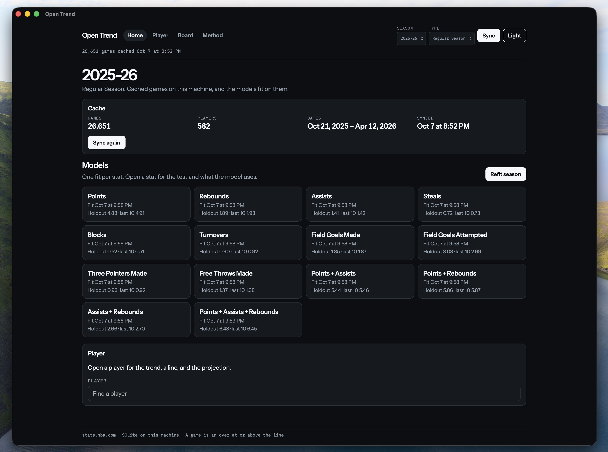
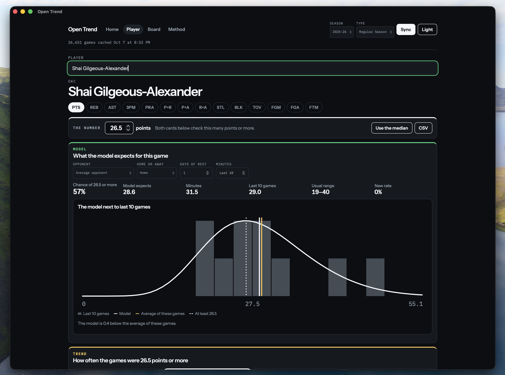

# Open Prop

Open Prop is a desktop app for NBA game logs. It shows how often a player cleared a number you pick, and it fits one rate-per-minute model per stat for the season. The model is there so you can read a probability and change the priors. It does not claim an edge against a book.

There is no odds feed, no American price, no implied probability, and no edge. A line is just the number you typed.

[Watch a one-minute demo](docs/demo.mp4).

The app is a [Tauri](https://tauri.app/) shell. Rust owns the cache, the sync, and the model. The screens are Svelte. Fitted models and the database stay on your machine. They are not part of this repository.

## Screens

### Home



Home is the cache and the models. It shows how many games are stored, when they were synced, and when each stat was last fit. Sync and refit live here. Open a stat for that model's priors and its holdout test, or open a player.

### Player



The player page is one player and one stat. You set the number being checked. Last 5, last 10, last 20, and the season are scored against that same number. The model card is the chance of that many or more for a spot you name: opponent, home or away, days of rest, and minutes. Leave the opponent blank for a league-average opponent. Leave minutes blank and the model uses a minutes distribution. Type minutes and that distribution collapses to the number you typed. The distribution chart draws the model's probabilities from zero up, next to the games in the selected window. Changing the number sums a tail that is already on the page. It does not ask the model again. Changing the player, the stat, the window, or the spot does.

The board is the short list. Pick a stat and a number. It keeps players who cleared that number in at least 70% of their last 10, with at least 8 games in that window and 10 games on the season. You can drop the floor to 60% or 80%, or show everyone and search. A row opens that player.

Method is the counting rules and the model, written out. It is not a second board.

## What a game counts as

A game clears the number when the stat is greater than or equal to it. A 26 against 26 counts. A line of 12.5 on the model means 13 or more, because the predictive is a count.

A game with 0 minutes is a did-not-play, not a miss. The hit rates, the board, and the model all leave it out, so the last 10 is the last 10 games he played. The player page says how many were left out, and the board shows the count in the season column.

| Stat | Id | Default number |
| --- | --- | --- |
| Points | `points` | 20 |
| Rebounds | `rebounds` | 6 |
| Assists | `assists` | 5 |
| Steals | `steals` | 1 |
| Blocks | `blocks` | 1 |
| Turnovers | `turnovers` | 2 |
| Field goals made | `field_goals_made` | 7 |
| Field goals attempted | `field_goals_attempted` | 15 |
| Threes made | `three_point_field_goals_made` | 2 |
| Free throws made | `free_throws_made` | 4 |
| Points + assists | `points_assists` | 25 |
| Points + rebounds | `points_rebounds` | 25 |
| Rebounds + assists | `assists_rebounds` | 10 |
| Points + rebounds + assists | `points_assists_rebounds` | 30 |

Combo stats are box-score sums. The player page fills the number from the median of the selected window until you type one. Changing the window does not move a number you already set.

The band under the hit rates is a 95% Wilson interval, z = 1.96. Five of the last ten is about 24% to 76%. The width is the result. The percentage in the middle is just where the count landed.

The chart marks a game green when it cleared and red when it missed. The gold path is the current game plus the two before it, inside the window only. The first two games have no average. That path describes the window. It does not forecast the next game.

Home and away come from the matchup text (`DAL vs. CHI` is home, `DEN @ SAS` is away). Back-to-back means the previous game in this cache was the day before. The other games are rested. These are the same games, counted again.

The player page can export the games in the window as CSV.

## The model

Train once per stat per season, from the home page. Every counting stat is a rate per minute. A short sample shrinks toward players in a similar minutes role, so five loud games cannot invent a new player. The shipped cuts are under 15 minutes, 15 to 28, and 28 or more.

Each opponent has its own multiplier, fit with the rates, so a big night against a soft defense does not all stick to the player. Home and an extra day of rest are two more multipliers. Their priors are tight, so the effects stay small unless the games support them. A blank opponent is a multiplier of 1. An opponent abbreviation that never appeared in the cache is an error.

The predictive count gets wider as the expected total gets higher, and it cannot go below zero. Blocks and steals keep their zeros in that same distribution. The percent at a line is that distribution, summed from the line up. The usual range is the middle 80% of it.

The trend window is part of the model. Last 5, last 10, and last 20 each get a second rate and a probability that those games are a real change rather than noise. If that probability is low, the prediction stays with the season rate. On the player page that probability is "New rate". The season window does not run the test. Combos do not show one number for it, because the parts can disagree.

Minutes have their own distribution: the last 10, shrunk toward the role, clipped from 0 to 48. Points, rebounds, and assists share that uncertainty, and so do the combos built from them. Given the minutes, the rates are separate. This is not a draw that scales every stat by one minute shock.

A combo is the sum of its parts. Points + assists is the points model plus the assists model. The combo file stores those fitted parts, so a prediction does not depend on load order. Home and rest are left off the combo page because the parts do not share one multiplier.

The last 20% of distinct dates are held out. The saved model is the one that did not see those dates. The model page shows that model's mean absolute error next to the player's own last-10 total on the same games, and how often the actual stat landed in the middle 80%. If the last-10 total was closer, both numbers still show. Holdout error stays on the model page. It is not on the player page.

### Last season as the prior

A fit starts from the season before it when that season is cached. A regular season carries the previous regular season. Playoffs carry the regular season they follow. Each player's rate prior adds his own totals from that season, adjusted for opponents, home, and rest, and capped at `carry_minutes` pseudo-minutes. The shipped cap is 1,000 minutes, so a starter's own games outweigh last season after about 30 games. His minutes start from last season's average, counted as three games. Each opponent multiplier starts from last season's, pulled toward 1 by `opponent_carry_minutes`. A team with no multiplier last season starts at 1.

A rookie, or anyone without minutes in the seed season, keeps the role prior. A traded player keeps his carry, because his rate is his and the multipliers belong to the opponents.

Until this season has 100 rows for a stat, the fit borrows last season's role rates, minutes, home, and rest. A seeded fit does not wait for 20 training rows, and it fits with none, so a player with carry can be priced before his first game. The player page says "Prior from 2024-25 Regular Season" while last season still outweighs this one. Everyone else still waits for five games. The model page names the season a fit carried. Untick "Carry last season" on the home page to fit without it, or set `carry_minutes` to 0 in one spec.

The shipped cap comes from a backtest on the first 10 team games of 2024-25 and 2025-26, each seeded from the season before. Every game was predicted from games before its date. Against the role prior alone, the carry cut log loss on every stat and bucket, most in team games 1 to 3, and it still helped in games 11 to 30. Caps from 500 to 2,000 scored about the same. `src-tauri/src/bin/backtest_prior.rs` reruns it on a scratch database filled by `sync-season`:

```bash
cd src-tauri
cargo run --release --bin sync-season -- /tmp/backtest.db 2024-25
cargo run --release --bin sync-season -- /tmp/backtest.db 2025-26
cargo run --release --bin backtest-prior -- /tmp/backtest.db 2025-26 2024-25 0,250,500,1000,2000 1500 10
```

### Opening night

Before a player's first game, the player list is this season's players plus everyone who played in the seed season, when that season is cached and "Carry last season" is ticked. A player without a game this season says "no games yet" in the list and on his page. Untick the carry and the list is this season's players only.

His team comes from this season's rosters. A sync of the season that is on, or from July the one about to open, also calls stats.nba.com `commonallplayers` for every player on a roster and stores the answer in SQLite. A carried player who is on no roster is dropped. A player on a roster with no carry is listed, so a rookie shows up, but he is still refused. If the roster call fails, or answers with fewer than 300 players, the stored roster is kept. With no roster at all, the team is his last one in the seed season, and the player page says "Team from 2024-25". Any other season never calls it, because the endpoint answers with today's teams whatever season it is asked for. Once a player has a game, his team is the one in his latest game.

At zero games his rate is the carry prior plus the role prior, his minutes start from last season's average, and opponent, home, and rest use the carried multipliers. The player page says "Prior from" the seed season. The trend says "No games this season yet" and shows last season's hit rate on the same line, labelled with that season. "Use the median" falls back to last season's median. A rookie at zero games is told he has no seed minutes to carry and waits for five games.

`backtest-prior` also scores each carried player's first game of the season, the `p-g1` columns. The fit for that game sees only earlier dates, so the first night is a fit with no rows from this season. On 2025-26 seeded from 2024-25, 464 first games:

| stat | log loss, role prior | log loss, carry 1,000 | CRPS, role prior | CRPS, carry 1,000 | calibration error, role prior | calibration error, carry 1,000 |
|---|---:|---:|---:|---:|---:|---:|
| Points | 5.834 | 3.314 | 6.465 | 3.354 | 0.177 | 0.017 |
| Rebounds | 2.938 | 2.127 | 2.067 | 1.282 | 0.153 | 0.030 |
| Assists | 2.552 | 1.724 | 1.413 | 0.914 | 0.150 | 0.028 |
| Threes made | 1.668 | 1.244 | 0.729 | 0.534 | 0.150 | 0.039 |
| PRA | 6.431 | 3.705 | 9.562 | 4.551 | 0.193 | 0.039 |

2024-25 seeded from 2023-24, 447 first games, moved the same way. Points log loss went from 5.624 to 3.156 and PRA from 6.338 to 3.543. The role prior alone is far off on the first night because it prices every player in a minutes role the same.

Without carry, a prediction waits until the player has five cached games. The first game of a season uses a neutral rest of 2 days, because there is no previous day in the cache. Later rest is the gap between games, capped at 14. There is no schedule feed. The opponent, the site, the rest, and the minutes are the spot you name. They are not "tomorrow".

Points are not literally a Poisson process. A point total is twos and threes. The working model is still a count per minute. The box score has no three-point attempts and no free-throw attempts, so the app does not invent a shot-level model.

An older tree file will not load. The home page asks you to refit.

## Changing the model

Each stat has a spec in [`models/specs`](models/specs). The app reads the first file it finds, in this order: `models/specs` from the working directory, `../models/specs`, `specs` in the app data folder, then the copy compiled into the binary. An edit takes effect the next time you refit.

Shipped values, same for every stat:

| Field | Shipped | What it does | Allowed |
| --- | --- | --- | --- |
| `prior_minutes` | 240 | Pseudo-minutes in the role prior. Larger shrinks a short sample harder. | (0, 5000] |
| `opponent_minutes` | 1500 | Pseudo-minutes that shrink an opponent multiplier toward 1. | (0, 20000] |
| `shift_prior` | 0.1 | Prior probability that the recent window is a new rate. | (0, 1) |
| `role_minutes` | `[15, 28]` | Rising cuts, in minutes, that separate roles. | 1 to 4 cuts, each in (0, 48) |
| `home_sd` | 0.08 | Prior standard deviation of the log home multiplier. | (0, 1] |
| `rest_sd` | 0.015 | Prior standard deviation of the log rest multiplier, per day. | (0, 0.2] |
| `carry_minutes` | 1000 | Most pseudo-minutes of last season in a player's rate prior. 0 turns the player carry off. | [0, 5000] |
| `opponent_carry_minutes` | 1500 | Pseudo-minutes that pull an opponent multiplier toward last season's. | [0, 20000] |

Training needs at least 20 rows after the holdout, unless the fit carries last season. A row is a game that already has five earlier games for that player. Games with zero minutes are skipped. The game being scored is not inside its own rate.

## Data

Sync asks `stats.nba.com/stats/playergamelogs` for one season type and stores the box score in SQLite on this machine. The host drops ordinary HTTP clients, so the app speaks with a Chrome TLS fingerprint. Retries are limited. All-Star games, whose ids start with `003`, are dropped. Numeric game ids are padded back to 10 digits before that check, because a number would lose the leading zeros.

Regular Season and Playoffs are separate syncs. The season label looks like `2025-26`. Before October 22 the suggested season is the one that just finished. On October 22 it moves to the season that is opening.

Stored columns are season, season type, player id, player name, team, game id, date, matchup, win or loss, minutes, points, rebounds, assists, steals, blocks, turnovers, field goals made and attempted, threes made, free throws made, and plus-minus. There are no offensive rebounds, no three-point attempts, no free-throw attempts, no position, and no schedule.

The database uses WAL mode. On macOS it lives at:

```text
~/Library/Application Support/com.openprop.desk/open-prop.db
```

A sync merges into the cache. Each game in the response replaces the cached copy, and cached games the response left out stay. If the response is empty, or carries under half the games already cached, nothing is written and the app shows a warning instead. A Playoffs sync before the playoffs start cannot empty anything.

Fitted models are JSON files in the `models` folder next to that database, one per stat, season, and season type: `models/2025-26/regular-season/points.json`. A Playoffs fit does not replace the Regular Season one. Files from older versions (`models/points.json`) move into the folder for the season stored inside them the next time the app starts. Only one fit runs at a time, and a model file is written whole or not at all. The browser preview at `pnpm dev` uses invented names. It does not call the NBA API, and it cannot train.

## Run

Requirements: Node 20.19 or newer (Vite 7's floor; 22.12 or newer also works), pnpm, Rust 1.90 or newer (Tauri 2.12's floor), and `cmake` plus `nasm`. The HTTP client builds BoringSSL, and those two tools are what that build needs. On Linux the build also needs libclang (`libclang-dev` on Debian and Ubuntu) and the usual Tauri WebKitGTK packages. The scripts in `scripts/` are TypeScript and run through `tsx`, so they do not depend on Node's own TypeScript support.

```bash
pnpm install
pnpm tauri dev
```

`pnpm tauri dev` is the desktop app. The window talks to a Vite server on port 1420.

You can also refit from the cache without opening the window. The default database path below is the macOS one.

```bash
cargo run --manifest-path src-tauri/Cargo.toml --bin train-season -- \
  "$HOME/Library/Application Support/com.openprop.desk/open-prop.db" \
  2025-26 "Regular Season"
```

The command prints holdout error, last-10 error, 80% coverage, and the row counts. Pass another database path, season, or season type as the three arguments. It carries the seed season when that season is in the same database, and it fits with no rows when this season has none. `sync-season` takes the same three arguments and fills a database without the window. For the season that is on, or about to open, it also stores the rosters.

## Tests

```bash
pnpm check          # Svelte and TypeScript
pnpm test           # vitest: catalog, formatting, sync messages, shared math fixture
pnpm test:math      # Wilson interval and the small desk helpers, through tsx
pnpm test:rust      # season calendar, parser, cache, sync merge, model files, shared math fixture
cargo test --manifest-path src-tauri/Cargo.toml -- --ignored live_regular_season
```

The ignored test downloads a regular season. It is the check that the client still gets through.

`tests/fixtures/desk-math.json` holds golden cases for the Wilson interval, the median, the mean, the sample deviation, the moving average, and the tail sum. `cargo test` and vitest both read it, so the Rust math and the TypeScript copies cannot drift apart. The stat list for the screens is `src/lib/catalog.json`, and a Rust test checks it against the Rust catalog.

## Layout

```text
src/                  SvelteKit screens
src-tauri/src/        Rust commands, cache, sync, and the model
models/specs/         Priors, one JSON file per stat
scripts/              The small math check
tests/fixtures/       Golden cases shared by cargo test and vitest
```

## License

Apache License 2.0. Copyright 2026 Adam Wickwire. See [LICENSE](LICENSE).
